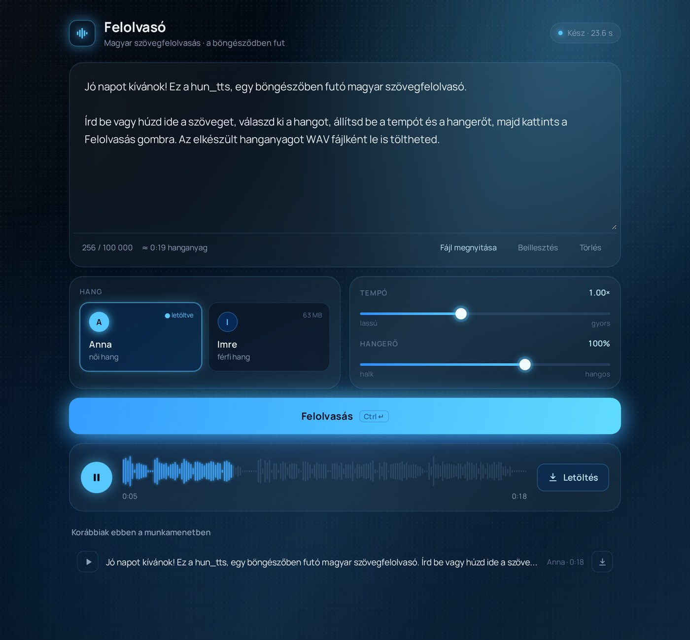

# hun_tts – magyar szövegfelolvasó

Böngészőben futó magyar szövegfelolvasó webapp. A szintézis a látogató gépén történik (Piper VITS modell, ONNX Runtime Web), szerver nem kell hozzá.

- Hangok: Anna (női), Imre (férfi) – Piper `hu_HU` medium modellek, első használatkor egyszer töltődnek le (~63 MB), utána a böngésző tárolja
- Tempó és hangerő állítása, letöltés WAV-ként
- Szöveg beírása, beillesztése vagy `.txt` / `.md` fájl betöltése (UTF-8 és Windows-1250 kódolás), max. 100 000 karakter
>Teszt - https://hun-tts.vercel.app/

## Futtatás

- Helyben: `HELYI_TESZT.bat` (Node.js kell), majd `http://localhost:3000`
- Vercel: a repó importálása, build nélkül (statikus oldal). A `vercel.json` beállítja a többszálú futáshoz szükséges COOP/COEP fejléceket.

## Felhasznált összetevők

- [Piper](https://github.com/rhasspy/piper) (MIT) – hangmodellek: Anna és Imre, CC0 adatkészletek ([OHF-Voice](https://github.com/OHF-Voice/voice-datasets)), az angol *lessac* modellből továbbtanítva ([licenc](https://www.cstr.ed.ac.uk/projects/blizzard/2013/lessac_blizzard2013/license.html))
- [onnxruntime-web](https://github.com/microsoft/onnxruntime) 1.18 (MIT)
- [piper-wasm](https://github.com/diffusionstudio/vits-web) fonemizáló (MIT), benne [espeak-ng](https://github.com/espeak-ng/espeak-ng) (GPL-3.0) – futáskor CDN-ről töltődik, nem része a repónak

## Licenc

A repó saját kódja: Apache 2.0. A hangmodellekre és a külső komponensekre a saját licencük vonatkozik.
